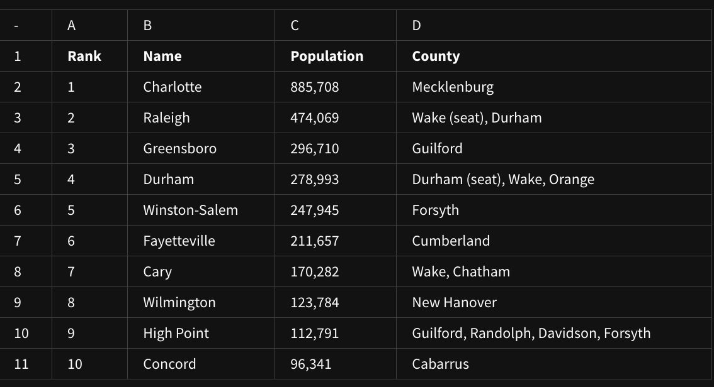
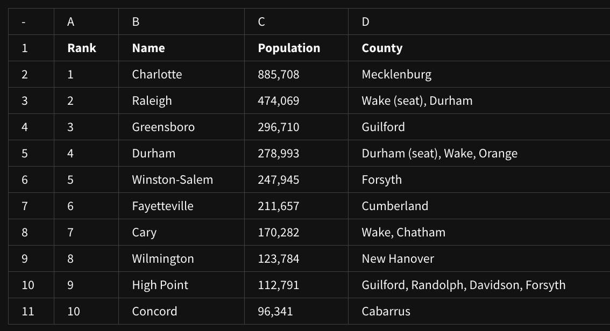
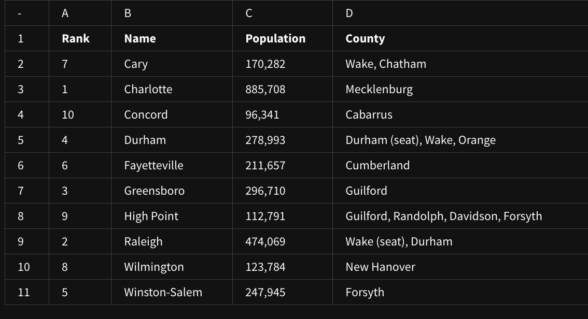
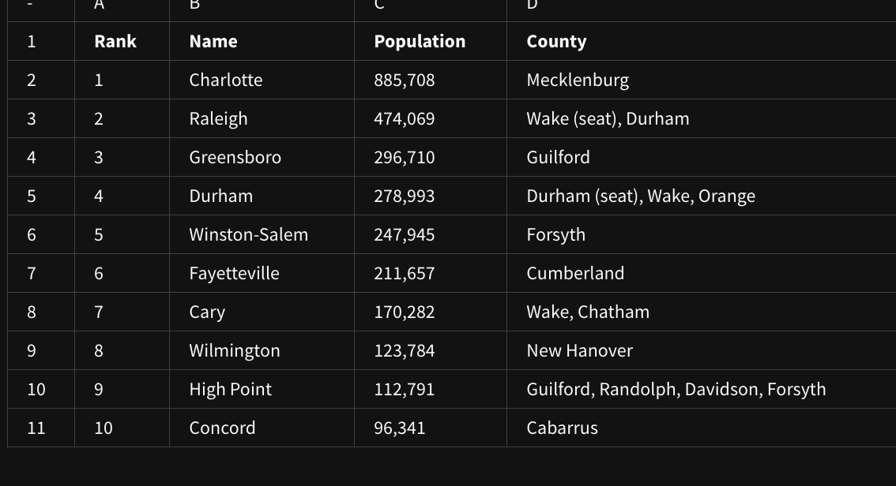
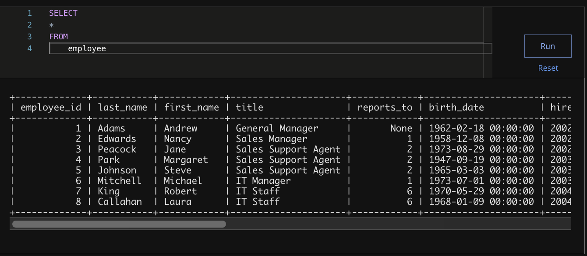
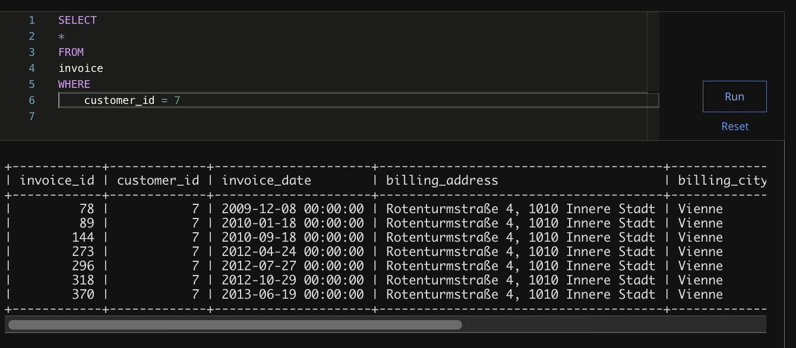

## Weekly challenge 4

### Question 1
The column attributes for rank, name, population, and county are located in which row of the following spreadsheet? 



* 10
* ```1```
* 2
* 11

### Question 2
In the following spreadsheet, where can you find all of the attributes—also known as the observation—of Fayetteville? 



* Row 6
* Column B
* Cell B7
* ```Row 7```

### Question 3
In the following spreadsheet, what feature was used to alphabetize the city names in column B?



* Name range
* Organize range
* Randomize range
* ```Sort range```

### Question 4
The function =AVERAGE(C2:C11) can be used to do what for the following spreadsheet? 



* Arrange the rows according to decreasing population size.
* Find the city with the largest population.
* Arrange the rows according to increasing population size.
* ```Find the average population of the cities```

### Question 5
You are working with a database table named employee that contains data about employees. You want to review all the columns in the table. 

You write the SQL query below. Add a FROM clause that will retrieve the data from the employee table.



* Andrew Adams
* ```Nancy Edwards```
* Michael Mitchell
* Margaret Park

> ```The clause FROM employee will retrieve the data from the employee table. The complete query is SELECT * FROM employee. The FROM clause specifies which database table to select data from. The employee Nancy Edwards has the job title of Sales Manager.```

### Question 6
You are working with a database table that contains invoice data. The customer_id column lists the ID number for each customer. You are interested in invoice data for the customer with ID number 7.

You write the SQL query below. Add a WHERE clause that will return only data about the customer with ID number 7.



After you run your query, use the slider to view all the data presented.

What is the billing country for the customer with ID number 7?

* ```Austria```
* France
* Brazil
* Poland

### Question 7
Which of the following best describes a bar chart?

* It is a visualization that plots a sequence of points and connects them with them with straight lines or curves.
* It is a visualization that uses a circle which is divided into wedges sized based on numerical proportion.
* It is a visualization that plots individual points in the Cartesian coordinate plane.
* ```It is a visualization that represents data with columns, or bars, the heights of which are proportional to the values that they represent.```

### Question 8
A company is curious about the population trend in Charlotte, NC. A data analyst in the company is tasked with creating a visualization that depicts such information. What type of chart would be best for this task and why?

* A line chart because it is a visualization that uses a circle which is divided into wedges sized based on numerical proportion.
* A pie chart because it plots a sequence of points and connects them with straight lines or curves. 
* ```A line chart because it plots a sequence of points and connects them with straight lines or curves.``` 
* A bar chart because it is a visualization that represents data with columns, or bars, the heights of which are proportional to the values that they represent.